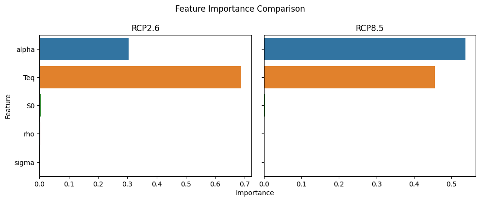
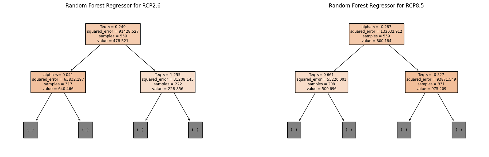

# GOAL
To look at the Global Mean sea level rise due to certain factors at different RCP levels
We are going to look at two RCP levels, RCP2.6 and RCP8.5

Since the GMSL is a continuous variable we are going to fit a random forest regression model.

# Import the libraries
You might need to install the all the libraries before importing it.

# Load data

1. Download the "samples_amh_gmsl2100.csv" data from the git hub repository and paste them in your working directory.
2. Then run the sea_level_rf file from the repository.

# Expected results
For Random Forest Regression Model on RCP2.6

1. The MSE on train data is 165.19
2. The MSE on test data is 980.65

For Random Forest Regression Model on RCP8.5

1. The MSE on train data is 188.66
2. The MSE on test data is 1282.35

2. Feature Importance comparison plot.

3. Decision tree visualization plot.

